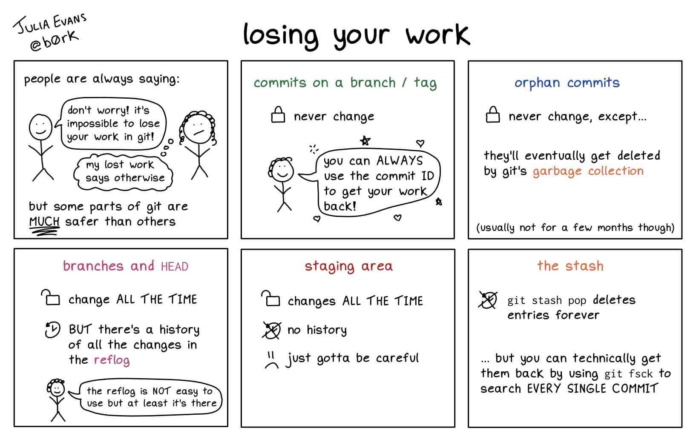

## Precursors {.smaller .nostretch}

:::: {.columns}
::: {.column width="55%"}
#### Slides and Materials

To access links or follow on your own device these slides can be found at:  
[cambridge-iccs.github.io/intermediate-git](https://cambridge-iccs.github.io/intermediate-git)

\

All materials are available at:

::: {style="font-size: 95%;"}

- [github.com/Cambridge-ICCS/intermediate-git](https://github.com/Cambridge-ICCS/intermediate-git)
:::
:::
::: {.column width="45%"}
#### Licensing

Except where otherwise noted, these presentation materials are licensed under the Creative Commons
[Attribution-NonCommercial 4.0 International](https://creativecommons.org/licenses/by-nc/4.0/legalcode) ([CC BY-NC 4.0](https://creativecommons.org/licenses/by-nc/4.0/)) License.

{width=40% fig-align="center"}

Vectors and icons by [SVG Repo](https://www.svgrepo.com)
used under [CC0(1.0)](https://creativecommons.org/publicdomain/zero/1.0/deed.en)
:::
::::


## Precursors {.smaller}

:::: {.columns}
::: {.column width="70%"}
- Be nice ([Python code of conduct](https://www.python.org/psf/conduct/))
- Ask questions whenever they arise.
  - Someone else is probably wondering the same thing.
  - For troubleshooting please write a message in the zoom chat and someone will assist you in a thread
  - For more general queries please raise a hand.
- We will make mistakes.
  - You can decide whick of them are intentional.
:::
::::


## Learning Objectives {.smaller}


The key objective of this workshop is to provide knowledge of some higher-level
functionalities within git beyond basic usage.

We will achieve this through a presentation and accompanying exercises.

:::: {.columns}
::: {.column width="55%"}
::: {.fragment .semi-fade-out data-fragment-index="1"}
* A deeper understanding of how git functions
* A recap of branching
* Stashing
* Patched and amended commits
* Rebasing
* Merge conflicts and resolution
* Bisect to locate issue introduction points
:::

:::

::: {.column width="45%"}
::: {.fragment data-fragment-index="1"}
I suggest you have open:

- A **text editor** or **IDE**
  - to edit code
- A **terminal window**
  - to run git
- A **browser window**
  - to follow these slides

:::

:::
::::

<!-- ============================================================================== -->

# Setup

## Setup {.smaller}

1.  Clone the repository (or use your fork):
    ```txt
    git clone https://github.com/Cambridge-ICCS/intermediate-git.git
    cd intermediate-git
    ```

2.  Create a Python virtual environment and install the library:
    ```txt
    python3 -m venv int-git-venv
    source int-git-venv/bin/activate
    pip install --editable .
    ```

3.  Verify everything works:
    ```txt
    (int-git-venv) $ python3
    Python 3
    Type "help", "copyright", "credits" or "license" for more information.
    >>> from thermolib import constants, moisture
    >>> constants.UNIVERSAL_GAS_CONSTANT
    8.314462618
    >>> moisture.calculate_relative_humidity(vapor_pressure=1500.0, temperature=298.15)
    np.float64(0.4735701395152745)
    ```

<!-- ============================================================================== -->

# Background

## What is git? {.smaller}

- a version control system developed by Linus Torvalds.^[Also the creator of Linux]
- tracks changes made to files over time.
- an entire suite of associated tools.

{.absolute top=33% width=40% left=30%}

::: {.attribution}
Rabbit hole from Disney's Alice in Wonderland under fair use
:::

## A Warning {.smaller visibility=hidden}



:::{.attribution}
[Julia Evans - \@b0rk](https://fosstodon.org/@b0rk@jvns.ca/111920509893059355)
:::

## How does git work? {.smaller}

A mental model:

- Each time you `commit` work git stores it as a `diff`.
  - This shows specific lines of a file and how they changed (`+`/`-`).
  - This is what you see with the `git diff` command.
- `diff`s are stored in a `tree`.
  - By applying each `diff` one at a time we can reconstruct files.
  - We do not need to do this in order\
    see cherry-picking and merge conflicts...

::: aside
See @Evans_2024_githistory for a longer discussion.
:::

<!----------------------------------------------------------------------------------->

## How does git work? {.smaller}

```{.diff code-line-numbers="|1,3-4|5|5-8,11-15,17-19|5-11,16-19"}
diff --git a/mycode/functions.py b/mycode/functions.py
index b784b07..d08024a 100644
--- a/mycode/functions.py
+++ b/mycode/functions.py
@@ -340,11 +341,10 @@ def rootfind(
         f_old = f_new
         if abs(s_new) > delta:
             x_new += s_new
+        elif s_bisect > 0:
+            x_new += delta
         else:
-            if s_bisect > 0:
-                x_new += delta
-            else:
-                x_new -= delta
+            x_new -= delta

         f_new = f_root(x_new, score)
         val = x_new
```

::: {.notes}
- Famous George Box quote
:::

<!----------------------------------------------------------------------------------->

## How does git work? {.smaller}

Actually:

- Each time you `commit` work git creates a `snapshot`
  - Contains the commit message, a hash ID, a pointer to a parent commit, and
    a list of all the files and folders in the repository.
- Given a hash we can reconstruct the repo at that state.

::: {.fragment}
Implications:

- Commits are immutable, but
- we can always make new commits, change the parent, and point a branch at them.
    - see `amend`, `rebase`, `cherry-pick`...
- Indeed, this is what we will do in much of this course!
:::

::: aside
See @Evans_2024_githistory and @Mukerjee_2024_unpacking for a longer discussion.
:::

::: {.notes}
- Famous George Box quote
:::

<!-- ============================================================================== -->

# Branches (recap)

## Branches {.smaller}

If we always work in `main` our commits appear linearly as we make them:

```{mermaid}
    %%{init: {'theme': 'dark',
              'gitGraph': {'rotateCommitLabel': true},
              'themeVariables': {
                  'commitLabelBackground': '#bbbbbb',
                  'commitLabelColor': '#ffffff'
    } } }%%
    gitGraph
       commit id: "1-ad4e"
       commit id: "4-ff6b"
       commit id: "0-fd7f"
       commit id: "1-2y4f"
       commit id: "4-664e"
       commit id: "6-d3et"
```

But what if:

- Someone else is modifying the same files as us?
- We are working on different aspects/features of the project in parallel?
- We find a bug and need to quickly fix it?

## Branches {.smaller}

Branches help with all of the aforementioned situations, but are a sensible way to
organise your work even if you are the only contributor.

:::: {.columns}
::: {.column width=55%}
```{mermaid}
    %%{init: {'theme': 'base',
              'gitGraph': {'rotateCommitLabel': true},
              'themeVariables': {
                  'commitLabelBackground': '#bbbbbb',
                  'commitLabelColor': '#ffffff'
    } } }%%
    gitGraph
       commit id: "4-ff6b"
       commit id: "0-fd7f"
       commit id: "fea 1.a"
       commit id: "fea 1.b"
       commit id: "fea 1.c"
       commit id: "fea 1.d"
       commit id: "5-af6f"
```

Conduct development in branches and merged into main when completed:

```{mermaid}
    %%{init: {'theme': 'base',
              'gitGraph': {'rotateCommitLabel': true},
              'themeVariables': {
                  'commitLabelBackground': '#bbbbbb',
                  'commitLabelColor': '#ffffff'
    } } }%%
    gitGraph
       commit id: "4-ff6b"
       commit id: "0-fd7f"
       branch feature
       commit id: "fea 1.a"
       commit id: "fea 1.b"
       commit id: "fea 1.c"
       commit id: "fea 1.d"
       checkout main
       merge feature
       commit id: "5-af6f"
```
:::
::: {.column width=45%}

- `git branch <branchname>`
  - Creates new branch _branchname_ from current point
- `git checkout <branchname>`
  - move to branch _branchname_
  - Updates local files - beware
- `git merge <branchname>`
  - Tie the _branchname_ branch into the current checked out branch with a merge
    commit.
:::
::::

::: aside
Note: We can always review our branches using `git branch -v`.
:::

<!----------------------------------------------------------------------------------->

## Branches {.smaller}

This comes into its own when working concurrently on different features.\
**git is not just about backups -- it is about project organisation.**

::: {.fragment}
This way danger and obscurity lies:

```{mermaid}
    %%{init: {'theme': 'base',
              'gitGraph': {'rotateCommitLabel': true},
              'themeVariables': {
                  'commitLabelBackground': '#bbbbbb',
                  'commitLabelColor': '#ffffff'
    } } }%%
    gitGraph
       commit id: "4-ff6b"
       commit id: "0-fd7f"
       commit id: "fea 1.a"
       commit id: "fea 1.b"
       commit id: "fea 2.a"
       commit id: "fea 1.c"
       commit id: "fea 2.b"
       commit id: "5-af6f"
       commit id: "1-ad4e"
```
:::

::: {.fragment}
This is manageable and _understandable_:

```{mermaid}
    %%{init: {'theme': 'base',
              'gitGraph': {'rotateCommitLabel': true},
              'themeVariables': {
                  'commitLabelBackground': '#bbbbbb',
                  'commitLabelColor': '#ffffff'
    } } }%%
    gitGraph
       commit id: "4-ff6b"
       commit id: "0-fd7f"
       branch feature_1
       commit id: "fea 1.a"
       commit id: "fea 1.b"
       checkout main
       branch feature_2
       commit id: "fea 2.a"
       checkout feature_1
       commit id: "fea 1.c"
       checkout main
       merge feature_1
       checkout feature_2
       commit id: "fea 2.b"
       checkout main
       merge feature_2
       commit id: "5-af6f"
       commit id: "1-ad4e"
```
:::

<!----------------------------------------------------------------------------------->

## Branches {.smaller}

The examples so far have been quite simple, but this gives a good audiovisual example
of the power of branches:

<iframe width="100%" height="70%" src="https://www.youtube.com/embed/S9Do2p4PwtE?si=aZbDMSksmq2UOfJV" title="YouTube video player" frameborder="0" allow="accelerometer; autoplay; clipboard-write; encrypted-media; gyroscope; picture-in-picture; web-share" allowfullscreen></iframe>

<!-- ============================================================================== -->

## Exercise 1 {.smaller}

Create a new branch to add an equation for **hydrostatic pressure** to
`thermolib/atmospheric.py`.

$$
P = P_0 \cdot \exp(-gz / (RT))
$$

where $g$ is gravity, $z$ is height, $R$ is the gas constant, $T$ is temperature,
and $P_0$ is the surface reference pressure.

::: aside
The gas constant and gravity are already available in `constants.py` and imported
into `atmospheric.py` as `GRAVITATIONAL_ACCELERATION` and
`SPECIFIC_GAS_CONSTANT_DRY_AIR`
:::

## Exercise 1 — Solution (Python) {.smaller}

```python
def calculate_hydrostatic_pressure(
    height: float,
    surface_pressure: float,
    temperature: float,
) -> float:
    return surface_pressure * np.exp(
        - GRAVITATIONAL_ACCELERATION
        * height
        / (SPECIFIC_GAS_CONSTANT_DRY_AIR * temperature)
    )
```

\

$$
P = P_0 \cdot \exp(-gz / (RT))
$$


## Exercise 1 — Solution (Git) {.smaller}

```txt
git checkout -b pressure-eqn
# <edit thermolib/atmospheric.py and save>
git add thermolib/atmospheric.py
git commit -m "Add hydrostatic-pressure equation to thermolib/atmospheric."
```

<!-- ============================================================================== -->

# Amending Commits

## Amending Commits {.smaller auto-animate=true}

It would be good to have included documentation and error-checking in the code.

We *could* make a new commit, but it makes more sense for these additions to be part of
the same previous commit; we want a clean history.

\

::: {.fragment}
Enter `git commit --amend`:

```txt
# Make your changes, stage them, then:
git commit --amend
```

:::

::: aside
Note: `--amend` replaces the old **previous** commit (complete with new hash), effectively **rewriting
history** for the branch.\
We should only use it on our commits in our branch, not on code by others or already on
`main`.
:::

## Amending Commits {.smaller auto-animate=true}

Enter `git commit --amend`:

```txt
# Make your changes, stage them, then:
git commit --amend
```

\

::: {style="font-size: 80%;"}
| Flag | Effect |
|:----:|:------:|
| None  | Open an interactive window to edit the existing message |
| `-m "new message"` | Overwrite the previous commit message |
| `--no-edit` | Keep the existing message |
:::

\

Tip: use `git log` or `git show` to review the last commit.

::: aside
Note: `--amend` replaces the old **previous** commit (complete with new hash), effectively **rewriting
history** for the branch.\
We should only use it on our commits in our branch, not on code by others or already on
`main`.
:::

## When is it useful? {.smaller}
- You forgot to add a file.
- You forgot to change something.
- You added something that shouldn't be in this commit.
    - for files: `git rm --cached`
    - for code: `git reset --soft` and `git restore --staged`
- You forgot to run formatting/linting.
- You made a typo in your commit message.


## Exercise 2 {.smaller}

Return to `pressure-eqn` and add a docstring to your
`calculate_hydrostatic_pressure` function.

Amend your previous commit to include these additions.

\

\

Hint: You can find example code on the next slide.

\

\

Extension: Also add input validation for the height, temperature,
and surface pressure.

::: aside
Tip: Since you're only modifying a tracked file you can stage all changes with:
```txt
git add -u
```
:::

## Exercise 2 — Solution (Python) {.smaller}

```python
    """
    Calculate pressure at height using hydrostatic equation.

    Describes how atmospheric pressure decreases with altitude. Uses the formula:
    P = P0 * exp(-g*z/(R*T)) where g is gravity, z is height, R is gas constant, T is temperature.

    Parameters
    ----------
    height : float
        Height above surface in meters (m)
    surface_pressure : float
        Surface pressure in Pascals (Pa)
    temperature : float
        Temperature in Kelvin (K)

    Returns
    -------
    float
        Pressure at specified height in Pascals (Pa)

    Raises
    ------
    ValueError
        If height is negative, surface pressure is not positive, or temperature is not positive
    """
    if height < 0:
        error_msg = "Height cannot be negative in atmospheric calculations"
        raise ValueError(error_msg)
    if surface_pressure <= 0:
        error_msg = "Surface pressure must be positive"
        raise ValueError(error_msg)
    if temperature <= 0:
        error_msg = "Temperature must be positive"
        raise ValueError(error_msg)
```

## Exercise 2 — Solution (Git) {.smaller}

```txt
# <edit file to add docstrings & validation>
git add -u
git commit --amend --no-edit
```

\

Running `git log` will show that you still have one commit on the
`pressure-eqn` branch, but now it contains the full
implementation (see `git show`) and has a different hash.

<!-- ============================================================================== -->

# Git Stash

## Exercise 3.1 {.smaller}

To illustrate the benefits of git stash we will start with an exercise adding a
new feature (equation) to our code.

\

Add an equation for **potential temperature** $\Theta$ on a *new* branch:

$$
\Theta = T \cdot (P_0 / P)^{(R / c_p)}
$$

where $c_p$ is the specific heat capacity of dry air at constant pressure.

\

Best practice says that for a new feature we should do this in new branch from `main`.

\

Note: Do **NOT** commit this work yet - we are about to be interrupted.

::: aside
$c_p$ is defined in `constants.py` as `SPECIFIC_HEAT_CAPACITY_DRY_AIR`.
:::

## Exercise 3.1 — Solution (Python) {.smaller}

```python
def calculate_potential_temperature(
    temperature: float, pressure: float, reference_pressure: float = 100000.0
) -> float:
    return temperature * (reference_pressure / pressure) ** (
        SPECIFIC_GAS_CONSTANT_DRY_AIR / SPECIFIC_HEAT_CAPACITY_DRY_AIR
    )
```

\

$$
\Theta = T \cdot (P_0 / P)^{(R / c_p)}
$$


## Exercise 3.1 — Solution (Git) {.smaller}

```txt
git checkout main
git checkout -b pot-temp-eqn
# <edit thermolib/atmospheric.py and save>
```

\

Remember, do not commit your code yet as we're about to be interrupted.

## Git Stash {.smaller}

You're halfway through implementing `calculate_potential_temperature` when a
colleague urgently needs the pressure equation merged to `main`.

\

If you try to switch branches:

```txt
git checkout main
```

you get:
```txt
error: Your local changes to the following files would be overwritten by checkout:
        thermolib/atmospheric.py
Please commit your changes or stash them before you switch branches.
Aborting
```

\

You *could* commit WIP and amend later, but **`git stash`** is designed for this.

## What is `git stash`? {.smaller}

`git stash` temporarily "stashes" (shelves) your uncommitted changes (staged and unstaged)
returning your working directory to the HEAD state.

\

The changes are stored on a FILO stack known as the stash.

| Command | What it does |
|:-------:|:-------------|
| `git stash push` | Shelve changes |
| `git stash list` | View all stashed items |
| `git stash pop` | Apply and remove the top stash |
| `git stash show` | Summary of what would be applied |
| `git stash drop` | Remove a stash entry (after manual resolution) |

\

After stashing, your working directory is clean and you can freely switch branches.

## When is it useful? {.smaller}

\

| Scenario | Why stash helps |
|:---------|:---------------|
| Working on the wrong branch | Stash, switch, pop on correct branch |
| Need to pull remote changes | Stash, pull, pop |
| Urgent fix on another branch | Stash, fix, commit, pop |
| Want to test/format only part of a commit | Stash the rest, test, pop |

## Exercise 3.2 {.smaller}

Stash your work on the `pot-temp-eqn` branch, return to `main` and merge in the
`pressure-eqn` branch.

\

Once this is done, return to `pot-temp-eqn` and `pop` your
work-in-progress from the stash.
Complete the implementation of the potential temperature equation and
then commit it.

## Exercise 3.2 — Solution (Git) {.smaller}

```txt
git stash push
git stash list

git checkout main
git merge pressure-eqn

git checkout pot-temp-eqn
git stash pop

# <finish editing thermolib/atmospheric.py and save>
git add thermolib/atmospheric.py
git commit -m "Add potential temperature equation to thermolib/atmospheric."
```

<!-- ============================================================================== -->

# Git Rebase and Merge Conflicts

## Rebasing {.smaller}

`git rebase` rewrites history by **replaying commits** on top of a new base.

:::: {.columns}
::: {.column width="50%"}
**Before rebase**

```{mermaid}
%%{init: {'theme': 'base', 'gitGraph': {'rotateCommitLabel': true}}}%%
gitGraph
   commit id: "A"
   commit id: "B"
   branch feature
   commit id: "D"
   commit id: "E"
   checkout main
   commit id: "C"
```
:::
::: {.column width="50%"}
**After rebase**

```{mermaid}
%%{init: {'theme': 'base', 'gitGraph': {'rotateCommitLabel': true}}}%%
gitGraph
   commit id: "A"
   commit id: "B"
   commit id: "C"
   branch feature
   commit id: "D'"
   commit id: "E'"
```
:::
::::

```txt
git checkout feature
git rebase main
```

\

As well as a branch to rebase on we can also specify a commit hash, tag etc.

## Rebasing tips  {.smaller}

- Interactive rebase
    - Opens an editor to provide more control over what we do with each commit.
        - edit, reorder, squash, fixup, reword, or drop commits.
    - `git rebase -i main`
    - Allows editing of previous commits -- amend for earlier in history
- Use `--onto` to specify exactly the commits to rebase
    - `git rebase --onto main HEAD~3`


## Merge Conflicts {.smaller}

A merge conflict occurs when we are moving around commits and two commits modify the
same lines in a file.

Often git can figure out what to do, but sometimes it isn;t clear and we need to decide
which version to keep.

This will appear in the file as:
```
<<<<<<< HEAD
latest version of the code on your branch
=======
conflicting version of the code
>>>>>>> other-branch
```

:::{.fragment}
### Resolution

Edit the file to keep the code you need, and remove that which you don't.

After resolving: `git add` then `git commit`^[If part of a rebase
we might use `git rebase --continue` instead.] as usual.
:::

## Exercise 4 {.smaller}

It would be a good idea to rebase our `pot-temp-eqn` on `main` to pick up the merged
changes from `pressure-eqn`.
Since this edited the `atmospheric.py` in the same location it will
create a **merge conflict**.

Resolve the conflict cleanly in your editor (hint: We want to keep
**both** functions.), `add` the result, and `continue` the rebase
until complete.

\

Finish off by returning to main and merging in the rebased `pot-temp-eqn` branch.

\

Try splitting into pairs, one of you use a direct rebase, the other
an interactive rebase.


## Exercise 4 — Solution {.smaller}

Direct:
```text
git checkout pot-temp-eqn
git rebase main
<Resolve the merge conflict, add, and continue to complete the rebase.>
git checkout main
git merge pot-temp-eqn
```

\

Interactive:
```text
git checkout pot-temp-eqn
git rebase -i main
<Review the interactive rebase before saving and exiting>
<Resolve the merge conflict, add, and continue to complete the rebase.>
git checkout main
git merge pot-temp-eqn
```

## Merge Conflicts - example {.smaller}

Often merge conflicts are easy with "keep ours", "keep theirs", or "keep both" as a solution.

But sometimes things are more complicated:

:::: {.columns}
::: {.column width="50%"}
::: {.fragment .semi-fade-out data-fragment-index="2"}
```txt
def f(x):
    ...
    return y
```
:::

:::

::: {.column width="50%"}
::: {.fragment data-fragment-index="1"}
```txt
<<<<<<< HEAD
def f(x, mu):
    ...
    return y - mu
=======
def f(x, sigma):
    ...
    return y / sigma
>>>>>>> other-branch
```
:::

:::
::::

\

::: {.fragment data-fragment-index="2"}
Resolution:

```txt
def f(x, mu, sigma):
    ...
    return (y - mu) / sigma
```
:::

<!-- ============================================================================== -->

# Patching Additions

## Patching Staged Additions {.smaller}

Sometimes you might have edited several parts of a single file during your work, but
want to split your changes into separate logical commits.

:::{.fragment}
`git add -p` (`git add --patch`) allows us to do this by working through each
"hunk" and asking what we should do:

| Option | Action |
|:---:|:-------|
| `y` | Stage this hunk |
| `n` | Skip this hunk |
| `s` | Split hunk into smaller parts |
| `e` | Manually edit the hunk |
| `?` | Show explanation of all options |

After staging selected hunks, commit them. Remaining changes stay in your
working directory for a future commit.
:::

## Exercise 5 {.smaller}

Make two distinct changes to `thermolib/constants.py`:

1. Update the `STANDARD_TEMPERATURE` comment:
   ```python
   STANDARD_TEMPERATURE = 288.15  # Standard temperature (K) at sea level
   ```
2. Add a new constant after the temperature setting:
   ```python
   LATENT_HEAT_VAPORIZATION = 2.5e6  # Latent heat of vaporization (J/kg)
   ```

This creates two separate hunks in the file. Use `git add -p` to stage and
commit only one change, then stage and commit the other.

## Exercise 5 - Solution {.smaller}

```txt
<edit thermolib/constants.py as described in the exercise and save.>
git add -p thermolib/constants.py
<Stage the STANDARD_TEMPERATURE (y), skip the LATENT_HEAT_VAPORIZATION (n)>
git commit -m "Clarify standard temperature as sea-level value"
git add -p thermolib/constants.py
# Stage the LATENT_HEAT_VAPORIZATION edit (y)
git commit -m "Add latent heat of vaporization constant"
```

\

Note: the `-p` is not strictly required the second time.

<!-- ============================================================================== -->

# Git Bisect

## Bisect {.smaller}

You discover that the test suite is **failing** on the latest commit, but you know
it was passing before. Manual searching could take a long time.

`git bisect` performs a **binary search** through your commit history to find the
exact commit that introduced a bug.

## Manual bisect process {.smaller}

For complicated processes we can run git bisect manually, only advancing to the next
commit when we are ready.

```txt
git bisect start
git bisect good <known-good-commit>
git bisect bad HEAD          # current commit is broken
# git checks out a midpoint commit
# You test it and mark:
git bisect good              # if it passes
git bisect bad               # if it fails
# Repeat until the offending commit is found
git bisect reset
```

## Automated bisect process {.smaller}

For more straightforward processes we can run automated bisect.

This takes a command and uses the exit code to decide if the commit is good (`0`)
or bad (non-`0`).
The full search can then be run without further user-input.

This is well suited to simple commands such as running a test-suite or searching for the
presence of a specific file/piece of code.

For example, with `pytest`:
```txt
git bisect start HEAD <known-good-commit>
git bisect run python -m pytest
```

## Exercise 6 {.smaller}

If we run the test suite for `thermolib` we see that someone made a commit at some point
that results in test failures. It's not obvious where, or why these two tests fail, so
we'd like to track this down with `git bisect`.

Use `git bisect` to locate the exact commit where the tests broke.

1.  Identify a known-good commit (check the log)
2.  Start the bisect
3.  Let `git bisect run` find the culprit

## Exercise 6 - Solution {.smaller}

Verify the broken tests:
```txt
pytest ./
```

Identify the offending commit using bisect:
```txt
git log --oneline          # identify good commit (e.g. 275ef1b)
git bisect start HEAD 275ef1b
git bisect run python -m pytest
git bisect reset
```

`git bisect` will narrow down to the single commit where tests first fail.

\

Note: we could use `pytest test/unit/test_moisture.py` to only run the failing tests.
<!-- ============================================================================== -->

# Closing

## Summary {.smaller}

| Topic | Key Command | What it does |
|:-----:|:-----------:|:-------------|
| **Amending** | `git commit --amend` | Add changes to the previous commit |
| **Stash** | `git stash push / pop` | Shelve WIP temporarily |
| **Rebase** | `git rebase` | Replay / squash commits |
| **Conflict resolution** | Manual edit + `git add` | Fix overlapping changes |
| **Patched additions** | `git add -p` | Add only parts (hunks) of a changed file |
| **Bisect** | `git bisect run` | Binary search for bugs |

## Beyond today {.smaller}

- **`git commit --fixup`**
    — mark a commit to be combined with an older one in history using rebase with auto-squash 
- **`git cherry-pick`**
    — apply a specific commit to the current branch
- **`git reflog`**
    — recovery of "lost" commits
- **Pre-commit hooks**
    — automate linting and testing before committing
- **Merge strategies**
    — merge commit, rebase, squash

<!-- ============================================================================== -->

## Where can I learn more? {.smaller}

- References and links in these slides
- [Pro Git book](https://git-scm.com/book/en/v2)
- If something has gone really wrong: [ohshitgit.com](https://ohshitgit.com/)

- GitButler's 2024 FOSDEM talk "so you think you know git?":
<iframe width="50%" src="https://www.youtube.com/embed/aolI_Rz0ZqY?si=cTgzuRQRB65STBGD" title="YouTube player" frameborder="0" allow="accelerometer; autoplay; clipboard-write; encrypted-media; gyroscope; picture-in-picture; web-share" allowfullscreen></iframe>

## Thanks {.smaller}

:::: {.columns}

::: {.column width="20%"}
Get in touch:
:::
::: {.column width="40%"}
 \ Jack Atkinson

 \ [jackatkinson.net](https://jackatkinson.net)

 \ [jwa34[AT]cam.ac.uk](mailto:jwa34@cam.ac.uk)

 \ [jatkinson1000](https://github.com/jatkinson1000)

 \ [\@jatkinson1000\@hachyderm.io](https://hachyderm.io/@jatkinson1000)
:::
::: {.column width="40%"}
 \ Mikolaj Kowalski

 \ [jwa34[AT]cam.ac.uk](mailto:mak60@cam.ac.uk)

 \ [Mikolaj-A-Kowalski](https://github.com/Mikolaj-A-Kowalski)
:::
::::


## References {.smaller}

::: {#refs}
:::
